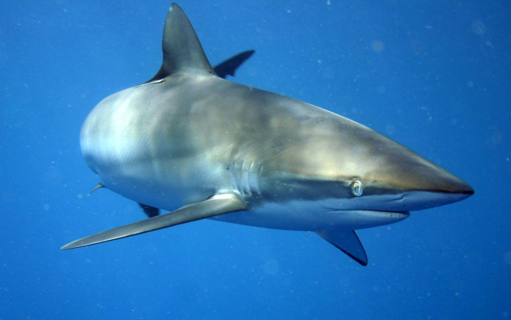
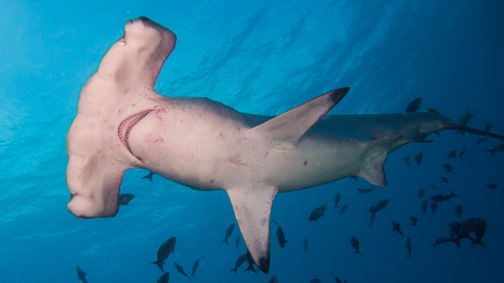
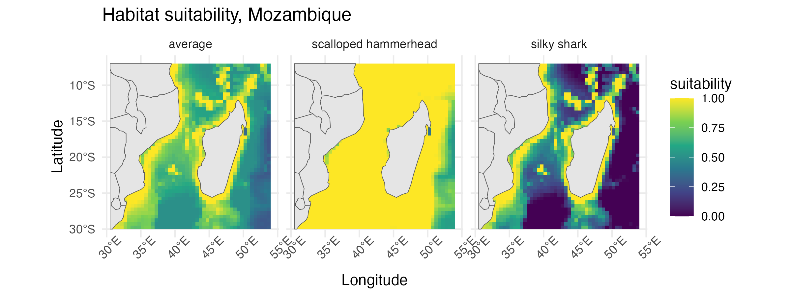

```{r setup}
#| echo: false

library(tidyverse)
library(terra)
library(sf)
library(here)
library(DT)
library(rnaturalearth)
```
 
How do we go from lines of letters and numbers to the finished graph above? Coding makes it possible. From graphs like this to apps you use every day - like Instagram or Google Maps - coding is the engine behind much of what we see and interact with. Scientists rely on the same process to study the environment.

Coding is the practice of writing instructions in a programming language - like R - that tell a computer how to analyze data, build graphs, or even create websites. Each block of code builds on the next, until it becomes a tool scientists can use to uncover patterns and solve problems.

But science is rarely a solo effort. Platforms like GitHub allow researchers to share and improve code together - bringing in perspectives from wildlife biologists to local communities.

This interactive display highlights how coding turns raw data into visualizations that can help tell the stories of the natural world and provide insights that inform conservation, policy, and action. 

Explore the dataset yourself: can you spot any patterns as the code reveals the story of Mozambique’s sharks?

## Exploring shark habitats in Mozambique

Here we look at data that estimate how suitable different parts of the ocean are for silky sharks and hammerhead sharks. By combining the two datasets, we can find areas that may be especially important for both species and conservation efforts.

```{r}
### Read in the suitability data
suitability_data <- read_csv('_data/shark_suitability.csv') %>%
  mutate(suitability = round(suitability, 3))

### Read in the map of ocean area
ocean_mask <- read_csv('_data/ocean_mask.csv')

### Examine the suitability data
DT::datatable(suitability_data)
```

As we can see in this table, the data set includes information as habitat suitability values for several species of shark, with locations identified by their latitude and longitude.  "Suitability" is based on the environmental conditions in each location, relative to the preferences of the species, on a scale from 0 (not suitable) to 1 (very suitable); for example, is the ocean temperature too cold, too warm, or just right?

::: {#fig-sharks layout-ncol=2}
{#fig-silky .lightbox width=400px height=250px}

{#fig-scalloped .lightbox  width=460px height=250}

Silky sharks and Scalloped hammerhead sharks are native to southeast Africa.  Click on images for a larger view.  Credit: [Silky shark by Alex Chernikh](https://en.wikipedia.org/wiki/Silky_shark#/media/File:Carcharhinus_falciformis_off_Cuba.jpg) () [CC2.5](https://creativecommons.org/licenses/by/2.5/deed.en)); [Scalloped hammerhead by Kris Mikael Krister](https://en.wikipedia.org/wiki/Scalloped_hammerhead#/media/File:Scalloped_Hammerhead_Shark_Sphyrna_Lewini_(226845659).jpeg) ([CC3.0](https://creativecommons.org/licenses/by/3.0/deed.en)).
:::


```{r}
silky_data <- suitability_data %>%
  filter(species == 'silky shark')

hammerhead_data <- suitability_data %>%
  filter(species == 'scalloped hammerhead')

### to find average, group across all species by lat/long, and calculate 
### the mean suitability across the two shark species
average_data <- suitability_data %>%
  group_by(long, lat) %>%
  summarize(suitability = mean(suitability), .groups = 'drop') %>%
  mutate(species = 'average')

```

## Adding geographic context

To better visualize the results, we’ll bring in a map of Africa and trim it to match the area of our shark data. This gives the habitat patterns clearer context on the map.

```{r}
### make a raster out of the `average` data frame using latitude/longitude
average_raster <- rast(average_data)

### import the Africa spatial data as a "simple features" object class
africa_sf <- rnaturalearth::ne_countries(continent = 'Africa', returnclass = 'sf') 

sf_use_s2(FALSE) ### this turns off 3-d geometry to avoid an error in the next step

### Crop the Africa outline to be the same lat/long extent as our data
africa_sf <- africa_sf %>%
  st_crop(st_bbox(average_raster))
```

## Visualizing habitat patterns

Finally, we combine the habitat information for silky sharks, hammerhead sharks, and their average values into one plot. Overlaying the outline of Africa helps us see where suitable shark habitats line up with the coastline.

```{r}
combined_data <- bind_rows(silky_data, hammerhead_data, average_data)

tripanel_plot <- ggplot() +
  geom_raster(data = combined_data, aes(x = long, y = lat, fill = suitability)) +
  geom_sf(data = africa_sf) +
  scale_fill_viridis_c() +
  facet_wrap(~ species) +
  theme_minimal() +
  theme(axis.text.x = element_text(angle = 45)) +
  labs(x = 'Longitude', y = 'Latitude',
       title = 'Habitat suitability, Mozambique')

ggsave('img/shark_suitability.png', height = 3, width = 8, dpi = 300)
```

{width=800px}

